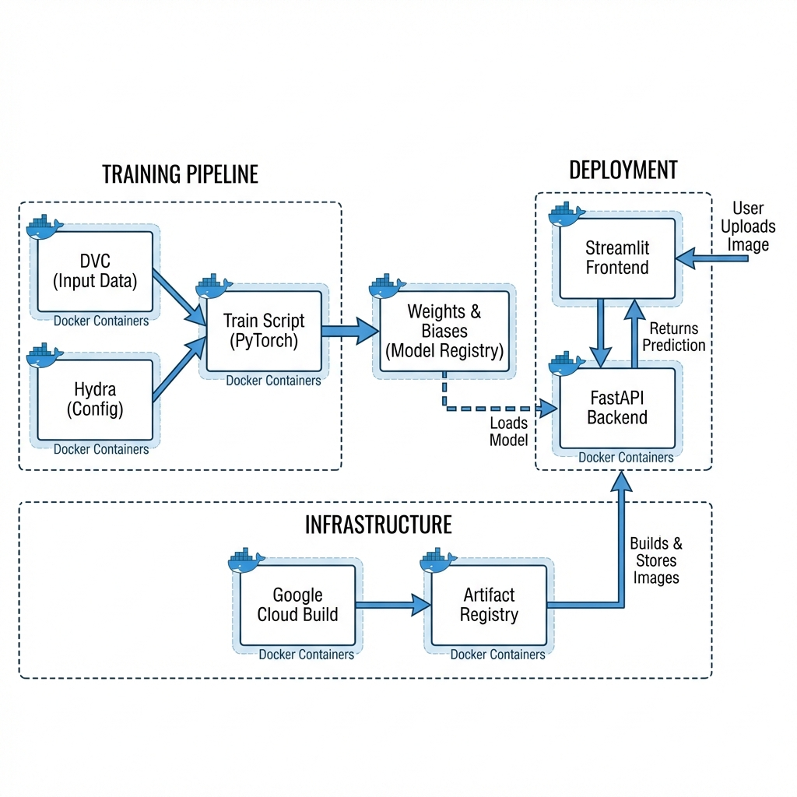

# MNIST MLOps

This project is a production-ready MLOps implementation for training and deploying a computer vision model (CNN) to classify images from the Corrupted MNIST dataset.

## How It Works


1.  **Upload**: You upload an image of a handwritten digit (like a messy '5').
2.  **Process**: Our AI model (running in the backend) analyzes the pixels.
3.  **Result**: The system tells you what number it sees!

## Technical Architecture



The system consists of three main technical stages:
1.  **Training**: A reproducible pipeline using **Hydra** for configuration and **PyTorch** for model training. Experiment metrics are tracked in **Weights & Biases**.
2.  **Deployment**: The trained model is served via a **FastAPI** backend. A **Streamlit** frontend provides a user interface for uploading images and viewing predictions.
3.  **Infrastructure**: The entire application is Dockerized. Google Cloud Build automates the creation of images, which are stored in the Artifact Registry.

## Quick Start
### 1. Install Dependencies
This project uses `uv` for fast dependency management.
```bash
uv sync
```

### 2. Train the Model
Run the training script (uses `src/mnist/train.py`):
```bash
uv run train
```
Configuration can be modified in `configs/config.yaml`.

### 3. Run the Application
Start the backend API and frontend UI locally:

**Backend (API):**
```bash
uv run uvicorn src.mnist.backend:app --reload
```
The API will be available at `http://localhost:8000`.

**Frontend (UI):**
```bash
streamlit run src/mnist/frontend.py
```
The UI will open in your browser at `http://localhost:8501`.

## Cloud Build
To build and push the Docker images to Google Cloud Artifact Registry:
```bash
gcloud builds submit .
```
This prepares the images for deployment (e.g., to Cloud Run or Kubernetes).

## Project Structure
- `src/mnist/`: Core source code (Backend, Frontend, Training, Model).
- `configs/`: Hydra configuration files.
- `dockerfiles/`: Docker definitions for the services.
- `.github/workflows/`: CI/CD pipelines for linting and testing.